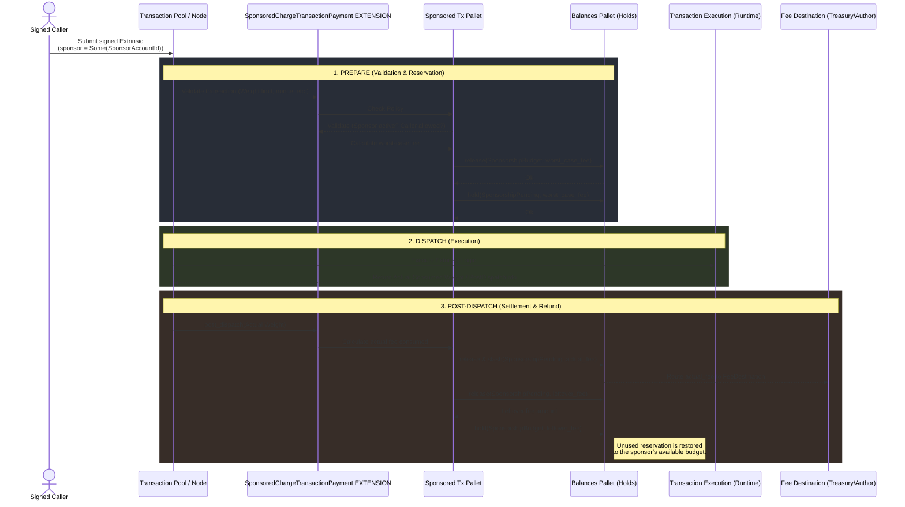

# Sequence Diagram

```mermaid
sequenceDiagram
    actor Caller as Signed Caller
    participant Node as Transaction Pool / Node
    participant Ext as SponsoredChargeTransactionPayment EXTENSION
    participant Pallet as Sponsored Tx Pallet
    participant Balances as Balances Pallet (Holds)
    participant Exec as Transaction Execution (Runtime)
    participant Dest as Fee Destination (Treasury/Author)

    Caller->>Node: Submit signed Extrinsic<br/>(sponsor = Some(SponsorAccountId))

    rect rgb(40, 45, 55)
        Note over Node, Balances: 1. PREPARE (Validation & Reservation)
        Node->>Ext: Validate transaction (Weight limit, nonce, etc.)
        Ext->>Pallet: Check Policy
        Pallet-->>Ext: Validate (Sponsor active? Caller allowed?)

        Ext->>Pallet: Calculate worst-case fee
        Pallet->>Balances: release(SponsorshipBudget, worst_case_fee)
        Balances-->>Pallet: Ok
        Pallet->>Balances: hold(SponsorshipPending, worst_case_fee)
        Balances-->>Pallet: Ok
    end

    rect rgb(45, 55, 40)
        Note over Node, Exec: 2. DISPATCH (Execution)
        Node->>Exec: Execute Extrinsic Logic
        Exec-->>Node: Return Actual Consumed Weight / PostDispatchInfo
    end

    rect rgb(55, 45, 40)
        Note over Node, Dest: 3. POST-DISPATCH (Settlement & Refund)
        Node->>Ext: post_dispatch(Actual Weight)
        Ext->>Pallet: Calculate actual fee consumed

        Pallet->>Balances: release & slash(SponsorshipPending, actual_fee)
        Balances-->>Dest: Route actual_fee to FeeDestination

        Pallet->>Balances: release(SponsorshipPending, leftover_fee)
        Balances-->>Pallet: Leftover fee amount

        Pallet->>Balances: hold(SponsorshipBudget, leftover_fee)
        Note right of Balances: Unused reservation is restored<br/>to the sponsor's available budget.
    end
```
